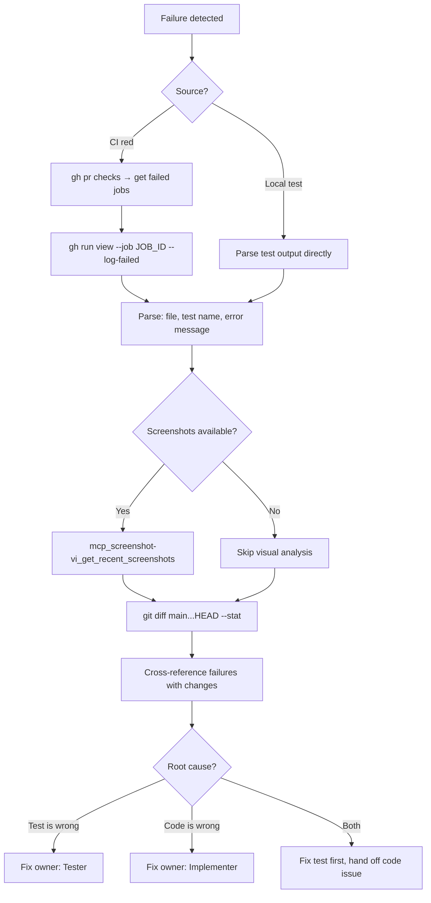

# CI Debugger

Diagnose CI failures by pulling logs, correlating with code changes, and proposing fixes.

## Prerequisites

- **gh CLI** — `gh auth status` must show "Logged in to github.com"
- **GitHub MCP** — `mcp_github_get_me` must return a `login` field
- **Screenshot Viewer MCP** (optional) — For visual test failure diagnosis

## Flow



## Commands

```bash
# Get repo from git remote
REPO=$(git remote get-url origin | sed 's/.*github.com[:/]//' | sed 's/\.git$//')

# Check PR status
gh pr checks {PR_NUMBER} --repo $REPO

# Get failed logs
gh run list --status failure --repo $REPO --limit 5
gh run view {RUN_ID} --repo $REPO
gh run view {RUN_ID} --job {JOB_ID} --log-failed --repo $REPO
```

## Failure Parsing

From CI logs or local output, extract:
1. **File and line** — which test failed
2. **Error message** — expected vs actual
3. **Stack trace** — where the error originated

For visual/E2E tests, always fetch screenshots:
```
mcp_screenshot-vi_get_recent_screenshots
mcp_screenshot-vi_get_screenshot → view specific failure
```
**Never ask user for screenshots — fetch them yourself.**

## Fix Ownership

| Root Cause | Owner | Action |
|------------|-------|--------|
| Test is wrong (selector, assertion, setup) | **Tester** | Fix the test |
| Code is wrong (bug in implementation) | **Implementer** | Hand off with diagnosis |
| Both need changes | **Tester first** | Fix test, then hand off code issue |

## Output

1. **Root cause** — which change broke which test
2. **Fix owner** — Tester or Implementer
3. **Proposed fix** — file and change needed
4. **Confidence** — high (clear correlation) or low (needs investigation)

## Rules

- Always pull actual CI logs — never guess
- Correlate failures with recent code changes
- Fetch screenshots for visual/E2E test failures
- Diagnose each failed job independently
