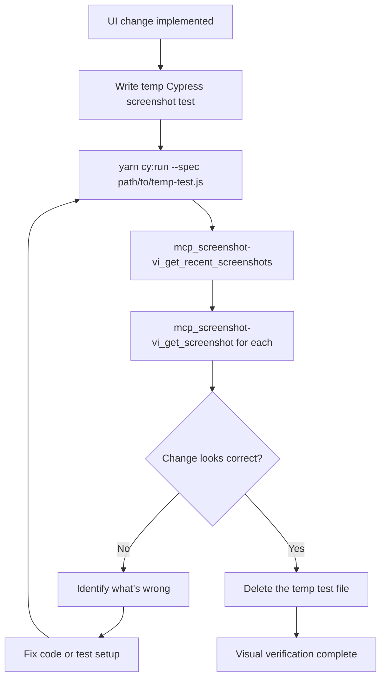

# Visual Verification

Write a throwaway Cypress test to screenshot the changed UI, view it via MCP, and iterate.

## Prerequisites

- **Screenshot Viewer MCP** — `mcp_screenshot-vi_list_screenshots` must return results
- **Dev server running** on port 3001
- **Cypress available** — `yarn cy:run` works

## Rules

- **Throwaway tests** — These are verification tools, not permanent test coverage. Delete when done.
- **Viewport captures** — Always use `{ capture: 'viewport' }` for full-page context
- **Descriptive names** — Screenshot names should describe what to look for (e.g., `alert-below-heading`, `form-error-state`)
- **Mock APIs** — Use `cy.intercept()` to set up the exact state you need to screenshot
- **One concern per screenshot** — Don't cram multiple checks into one capture

## Flow



## Test Pattern

```javascript
// tmp-screenshot-verify.cypress.spec.js
describe('Visual Verification - {what you changed}', () => {
  it('screenshots the change', () => {
    // 1. Set up intercepts for the page state you need
    cy.intercept('GET', '/api/endpoint', { fixture: 'response.json' });

    // 2. Login if needed, navigate to the page
    cy.login();
    cy.visit('/path/to/page');

    // 3. Interact to reach the target state
    cy.get('[data-testid="trigger"]').click();

    // 4. Wait for the element you changed to be visible
    cy.get('[data-testid="changed-element"]').should('be.visible');

    // 5. Screenshot with descriptive name
    cy.screenshot('descriptive-name-of-what-to-check', { capture: 'viewport' });
  });
});
```

## Viewing Screenshots

```
mcp_screenshot-vi_get_recent_screenshots    → find what was just captured
mcp_screenshot-vi_get_screenshot(path)      → view the actual image
mcp_screenshot-vi_search_screenshots(query) → find by name if many exist
```

Screenshots land in `cypress/screenshots/{spec-file-name}/`.

**Never ask the user to look at screenshots — view them yourself via MCP.**
