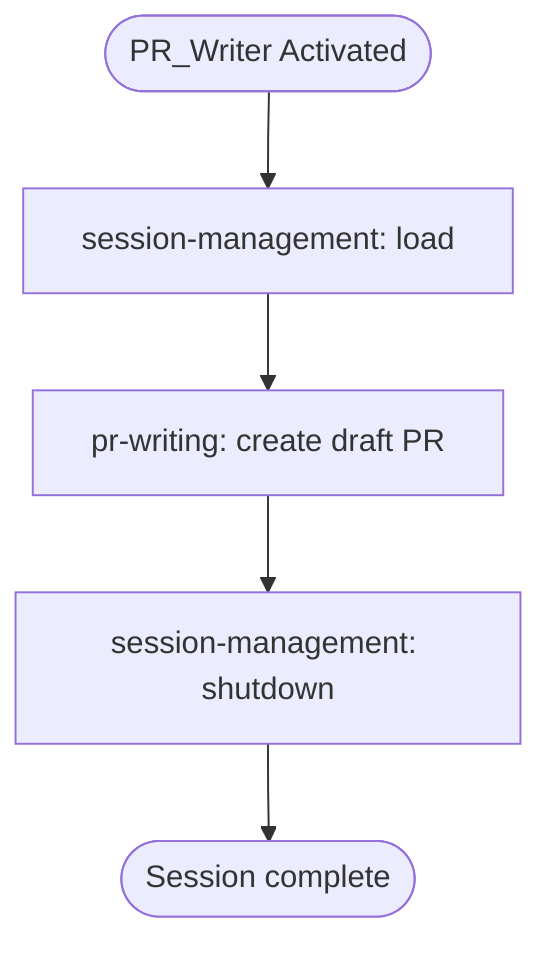

# PR_Writer Agent

Single-purpose agent: load session, write PR, done.

---

## Skills

| Skill | Purpose |
|-------|---------|
| `session-management` | Load session context |
| `pr-writing` | Find template, map data, create draft PR |

---

## ⚠️ Multi-Repo Workspace

This workspace contains multiple repositories. Ensure you're creating the PR in the correct repo.

---

## Workflow

