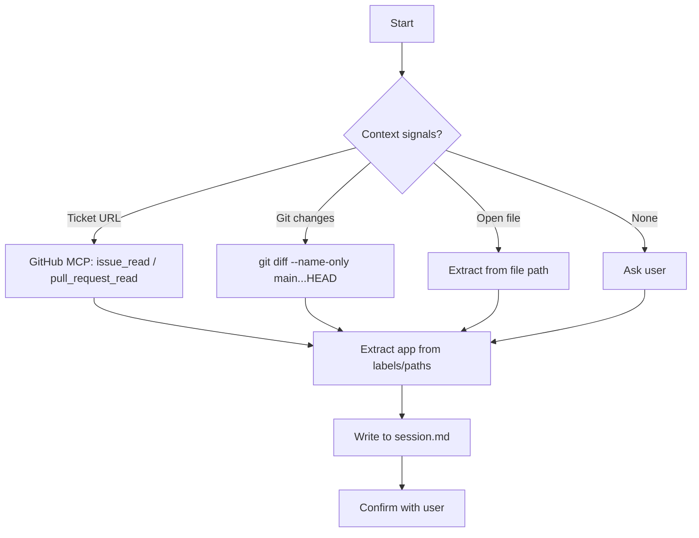

# Context Discovery

Detect repository and identify the target application/module.

## Prerequisites

- **GitHub MCP** (optional) — Only for ticket URL detection. Verify with `mcp_github_get_me`.

## Flow

## Detection Methods

1. **From ticket** — Check labels, scan body for file paths
2. **From git diff** — Extract app folder from changed files
3. **From current file** — Parse path for app/module name

## Output

Write to `session.md` header:

- **Application:** `{app-name}`
- **Application Path:** `{path/to/app}`

## Rules

- Ignore `copilot-config` folders
- Never guess — use signals or ask user
