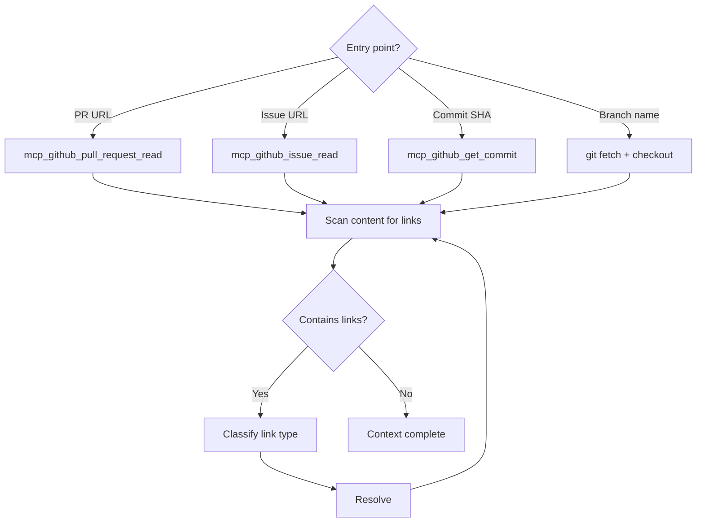
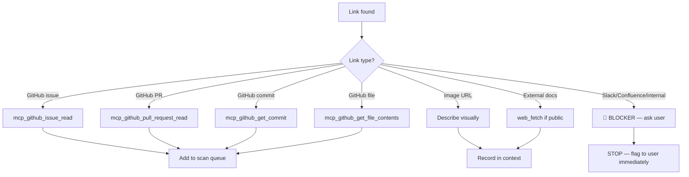

# GitHub Context Gathering

Fetch GitHub resources and recursively resolve all linked content.

## Prerequisites

- **GitHub MCP** — `mcp_github_get_me` must return a `login` field
- **gh CLI** (fallback) — `gh auth status` must show "Logged in"

## ⚠️ Required Tools

**MUST use one of:**
- `gh` CLI commands
- `mcp_github_*` tools

**NEVER use:**
- Direct URL fetching (web_fetch, curl, etc.)
- Raw API calls without authentication

Direct fetching returns HTML/login pages, not useful data.

## Flow



## Recursive Link Resolution

Scan ALL fetched content (title, body, comments) for links. Resolve each:



### Link Classification

| Pattern | Type | Action |
|---------|------|--------|
| `github.com/.../issues/N` | Issue | `mcp_github_issue_read` |
| `github.com/.../pull/N` | PR | `mcp_github_pull_request_read` |
| `github.com/.../commit/SHA` | Commit | `mcp_github_get_commit` |
| `github.com/.../blob/...` | File | `mcp_github_get_file_contents` |
| `#N` in same repo | Issue/PR | Fetch with same owner/repo |
| `*.slack.com/*` | Slack | **🚫 BLOCKER** — stop and ask user for content |
| `*.atlassian.net/*` | Confluence | **🚫 BLOCKER** — stop and ask user for content |
| Any other inaccessible URL | Internal | **🚫 BLOCKER** — stop and ask user for content |
| `*.png`, `*.jpg`, `*.gif` | Image | Describe what you see |

### Depth Limit

- **Max depth:** 3 levels of recursion
- **Cycle detection:** Track visited URLs, skip duplicates
- **Timeout:** If > 10 resources, summarize and ask user if more needed

## Branch Checkout

When a PR is involved, always checkout the branch:

```bash
# Extract owner/repo from remote
REPO=$(git remote get-url origin | sed 's/.*github.com[:/]//' | sed 's/\.git$//')

# Fetch and checkout PR branch
git fetch origin {branch}:{branch}
git checkout {branch}
git pull --ff-only
```

## Output

Write gathered context to `session.md` (see `session-management` skill for format):

- **Ticket/PR/Branch** → Session header fields
- **Linked issues/PRs** → Referenced in Handoff Notes
- **Unresolved links** → Listed in **Blockers** section (see below)

## 🚫 Unfetchable Link Handling

Links to Slack, Confluence, or any other non-GitHub/non-public resource are **BLOCKERS**. They often contain critical context (design decisions, payload requirements, scope clarifications) that cannot be guessed.

**When an unfetchable link is found, you MUST:**

1. **Immediately flag it to the user** — do not continue silently
2. **List every unfetchable link** with its source (which issue/PR/comment contained it)
3. **Explain what context is likely missing** (e.g., "This Slack thread may contain payload format details referenced by the ticket")
4. **Record in session.md** under a `## Blockers` section:
   ```markdown
   ## Blockers
   - 🚫 **Slack thread inaccessible**: https://dsva.slack.com/archives/... (linked from issue #130841 body — may contain payload/design decisions)
   - 🚫 **Confluence page inaccessible**: https://... (linked from PR #456 description)
   ```
5. **Do not mark planning as complete** until the user has provided the content or explicitly confirmed it is not needed

**Never assume unfetchable links are unimportant.** If the link was included in the ticket, it was included for a reason.

## Rules

1. **Resolve recursively** — follow every GitHub link
2. **BLOCK on unfetchable links** — Slack, Confluence, internal docs are blockers, not warnings
3. **Track visited** — avoid infinite loops
4. **Checkout PR branch** — when PR is the entry point
