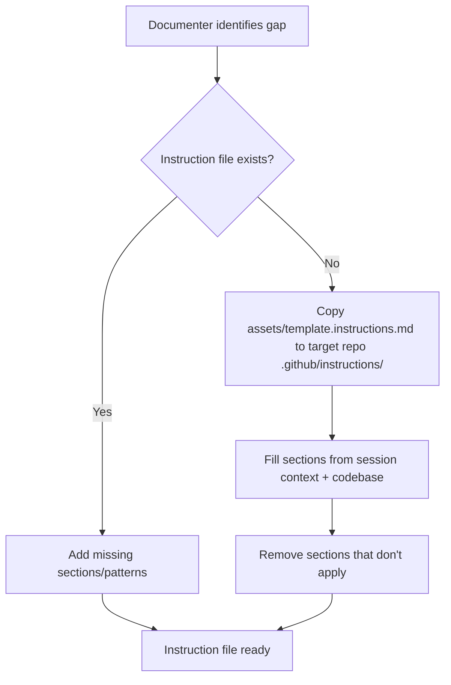

# Instruction Authoring

Create or update `.github/instructions/{name}.instructions.md` files in host repos.

**Asset:** `assets/template.instructions.md`

## When to Use

- No instruction file exists yet for the app/module — scaffold one from template
- Existing instruction file is missing sections or patterns discovered during the session

## Rules

- **Target repo only** — instruction files go in the host project, never in copilot-config
- **Replace all placeholders** — no `{like-this}` left in the final file
- **Prune empty sections** — remove anything not applicable rather than leaving blanks
- **Frontmatter required** — `applyTo` must match the app/module path
- **Self-maintenance section stays** — always keep the "When to Update" guidance so future agents maintain the file

## Flow

