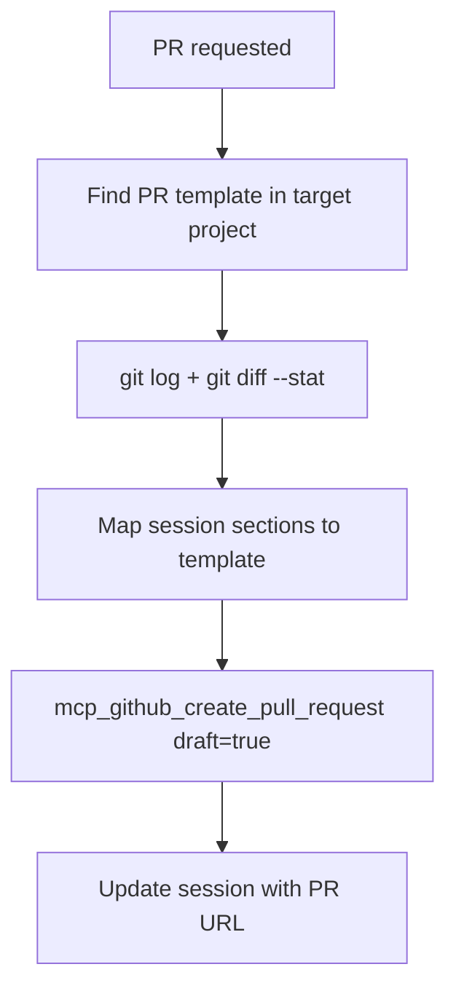

# PR Writing

Create a draft PR from session context and git state.

## Prerequisites

- **GitHub MCP** — `mcp_github_get_me` must return a `login` field

## Find PR Template

Search the **target project's** `.github/` directory for the PR template:

```bash
find {target-project}/.github -iname "pull_request_template*" -type f 2>/dev/null
```

If no template exists, use a simple Summary / Related Issue / Changes / Testing structure.

## Data Mapping

| PR Section | Session Source |
|------------|--------------|
| Summary | Handoff Notes or spec summary |
| Related Issue | Ticket URL from session header |
| Changes | Files Modified + Files Created |
| Testing | Test Results section |
| Decisions | Decisions section (if noteworthy) |

Supplement with:

```bash
git log origin/main..HEAD --oneline
git diff origin/main --stat
```

## Writing Style

- **Minimal** — One sentence per concept. No elaboration.
- **Direct** — State what changed. No preamble.
- **No emoji** — Plain text only.
- **Template-driven** — Use exact section headers from the repo's template.
- **Facts only** — What, why, how. No marketing language.

## Rules

- Always create as **draft** — never publish directly
- Title: brief, imperative mood (e.g., "Add error handling for API failures")
- Follow the repo's template structure exactly
- Every word must earn its place — only include what helps a human reviewer
- No filler sections — if a section has nothing useful, omit it

## Flow


