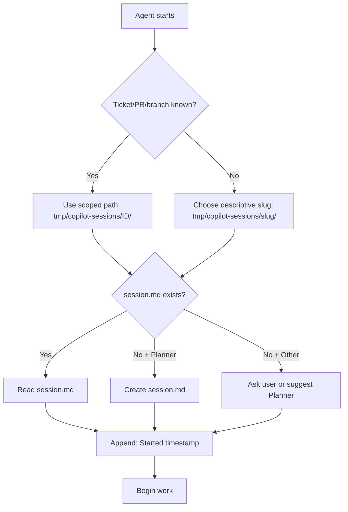
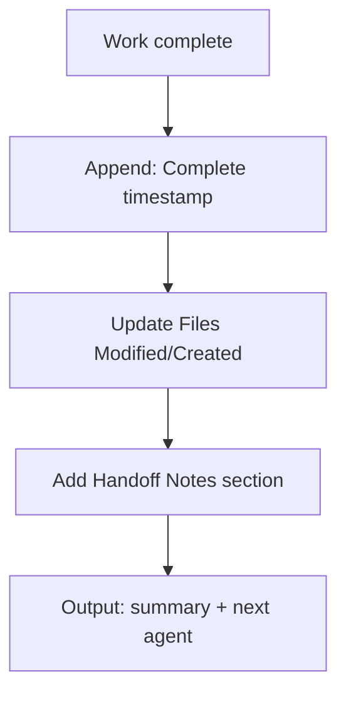

# Session Management

Manage `tmp/copilot-sessions/` in the **target project** (not `copilot-config`) for cross-agent continuity.

## Directory Structure

Sessions should be scoped by ticket or PR to avoid overwriting each other when working on multiple tasks in the same repo. Use the ticket number, PR number, or a short slug derived from the branch name as the subdirectory name.

```
tmp/copilot-sessions/
├── 12345/                # Scoped by ticket number (preferred)
│   ├── session.md
│   └── spec.md
├── pr-6789/              # Scoped by PR number
│   ├── session.md
│   └── spec.md
├── fix-login-redirect/   # Scoped by branch slug
│   ├── session.md
│   └── spec.md
└── refactor-auth-flow/   # Scoped by agent-chosen name
    ├── session.md
    └── spec.md
```

**Scoping priority:**
1. **Ticket number** — e.g., `tmp/copilot-sessions/12345/` (best for traceability)
2. **PR number** — e.g., `tmp/copilot-sessions/pr-6789/` (use when no ticket exists)
3. **Branch slug** — e.g., `tmp/copilot-sessions/fix-login-redirect/`
4. **Agent-chosen name** — a short, descriptive slug when no ticket, PR, or branch is known (e.g., `refactor-auth-flow`)

## Session Format

`session.md` is the single source of truth. All agents read and append to it.

```markdown
# Session

- **Application:** {app-name}
- **Application Path:** {path/to/app}
- **Branch:** {branch-name}
- **Ticket:** {url or N/A}
- **PR:** {url or N/A}

## Timeline
| Timestamp | Agent | Action |
|-----------|-------|--------|
| YYYY-MM-DD HH:MM | Planner | Started - context gathering |
| YYYY-MM-DD HH:MM | Planner | Complete - spec ready |

## Files Modified
- {path/to/file}

## Files Created
- {path/to/file}

## Decisions
### YYYY-MM-DD - {Title}
- **Rationale:** {Why}
- **Agent:** {Who}

## Handoff Notes
### Planner → Implementer
{Summary of what's ready and what to do}

## Test Results
| Run | Agent | Total | Passed | Failed | Notes |
|-----|-------|-------|--------|--------|-------|
| YYYY-MM-DD HH:MM | Tester | 12 | 10 | 2 | selector failures |
| YYYY-MM-DD HH:MM | Tester | 12 | 12 | 0 | all green |

## Review Findings
### Summary
{Overall assessment}

### Strengths
- {What's done well}

### Must Fix
- {Blocking issues}

### Suggestions
- {Non-blocking improvements}
```

## Startup



## Shutdown



## Rules

- Scope sessions by ticket/PR/branch to prevent parallel work from colliding
- Read on startup, append on shutdown — never overwrite other agents' entries
- The last Timeline row = current state
- Never block — adapt if session missing
- Always include actionable handoff notes

## Decision Tracking

When making choices not covered by spec or instructions, append to the Decisions section:

```markdown
### YYYY-MM-DD - {Title}
- **Rationale:** {Why}
- **Agent:** {Who}
```
