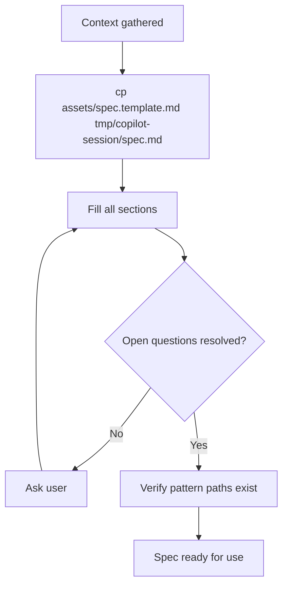

# Spec Creation

Generate `tmp/copilot-session/spec.md` to capture what needs to be done, what's been decided, and what's in scope — useful for planning new work, handing off between agents, or resuming a session.

**Asset:** `assets/spec.template.md`

## When to Use

- Planning new implementation work
- Handing off context between agents (e.g., Planner → Implementer, Tester → Implementer)
- Documenting decisions and scope for a complex task
- Resuming work across sessions where context needs to be preserved

## Flow

## Template Sections

| Section | Content |
|---------|---------|
| Context | Ticket, app, branch, PR |
| Summary | One paragraph description |
| Acceptance Criteria | Specific, testable checkboxes |
| Files to Create | Path + purpose |
| Files to Modify | Path + what changes |
| Patterns to Follow | Existing code references |
| API Contracts | Request/response shapes |
| Edge Cases | Error handling table |
| Out of Scope | Explicit exclusions |
| Open Questions | Must resolve before handoff |
| Decisions | Rationale for choices |

## Rules

- Every section must be filled — no placeholders
- Open questions must be resolved before handoff
- Patterns must reference real files (verify they exist)
- Acceptance criteria must be testable
